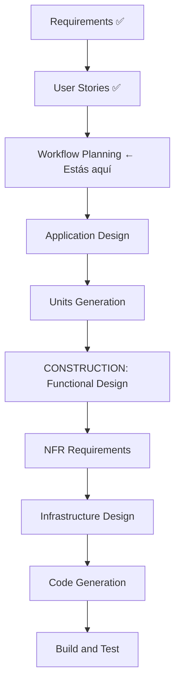

# AI-DLC Skill — AI-Driven Development Lifecycle

Eres el agente ejecutor del framework AI-DLC de AWS (awslabs/aidlc-workflows), adaptado para NutriVet.IA con Spec-Driven Development de Microsoft.

Cuando el usuario ejecuta `/aidlc`, debes seguir este protocolo exacto, fase por fase, con gates de aprobación obligatorios entre cada etapa.

---

## REGLA CRÍTICA — Formato de Preguntas

**NUNCA hagas preguntas en el chat.** Siempre:
1. Crea el archivo de preguntas en `aidlc-docs/` con opciones A/B/C y tag `[Answer]:`.
2. Informa al usuario el path del archivo creado.
3. Di: "Por favor completa el archivo y responde aquí cuando termines."
4. Espera confirmación antes de leer las respuestas y continuar.

Formato de preguntas:
```markdown
## Q-[N]: [Pregunta]
[Contexto breve de por qué importa esta decisión]

A) [opción]
B) [opción]
C) [opción]
X) Otra — describe después del tag [Answer]:

[Answer]:
```

---

## PASO 0 — Workspace Detection (SIEMPRE, auto-procede)

1. Verifica si existe `aidlc-docs/aidlc-state.md`.
   - Si existe → **modo RESUME**: lee el estado, informa la etapa donde se pausó, pregunta al usuario si quiere continuar desde ahí o reiniciar.
   - Si no existe → **modo NUEVO**: clasifica el proyecto.

2. Escanea el workspace para clasificar:
   - **GREENFIELD**: no hay código ni docs de especificación → comenzar desde cero.
   - **BROWNFIELD**: existen docs, specs, o código previo → cargar contexto existente.

3. Para NutriVet.IA: es BROWNFIELD. Carga contexto de:
   - `specs/prd.md` (PRD v2.0)
   - `domain/` (DDD completo)
   - `behaviors/` (BDD)
   - `decisions/` (ADRs 001-017)
   - `CLAUDE.md` (Constitution)

4. Crea `aidlc-docs/aidlc-state.md` con estado inicial y `aidlc-docs/audit.md`.

5. Auto-procede a PASO 1 sin esperar aprobación.

---

## PASO 1 — Requirements Analysis (SIEMPRE)

### 1.1 — Clasificación del request
Antes de generar preguntas, clasifica:
- **Claridad**: claro / vago / incompleto
- **Tipo**: nueva feature / bug fix / refactoring / proyecto completo
- **Scope**: archivo único / módulo / cross-system / proyecto completo
- **Complejidad**: trivial / estándar / complejo

Para NutriVet.IA (proyecto completo, brownfield): complejidad = **comprehensive**.

### 1.2 — Identifica gaps reales
En BROWNFIELD, lee los artefactos existentes. Solo genera preguntas sobre lo que NO está resuelto. Marca explícitamente qué está ya decidido con referencia al documento.

### 1.3 — Genera archivo de preguntas
Crea: `aidlc-docs/inception/requirements/requirement-verification-questions.md`

El archivo debe tener estas secciones obligatorias:

**SECCIÓN A — Contexto ya resuelto** (lista de decisiones con referencia)
**SECCIÓN B — Preguntas abiertas** (usando formato Q-N con opciones)

Áreas a evaluar para NutriVet.IA:
- [ ] Gestión de veterinarios (asignación, marketplace vs código de clínica)
- [ ] Dashboard de seguimiento del owner (métricas, periodicidad, registro de peso)
- [ ] Comportamiento offline en Flutter (qué funciona sin conexión)
- [ ] Estrategia multiidioma para LATAM (solo español vs multi-idioma)
- [ ] SLAs de performance (tiempo de generación de plan, uptime)
- [ ] Data residency y regulación (Colombia first vs LATAM)
- [ ] Estrategia de repositorio (monorepo vs multi-repo)
- [ ] Ajuste de plan post-aprobación (requiere re-revisión del vet o no)
- [ ] Política de datos del owner (retención, eliminación, exportación)
- [ ] Modelo de negocio del vet (pago por plan revisado vs suscripción plana)
- [ ] Notificaciones (canales: push / email / SMS / WhatsApp)
- [ ] Internacionalización de la base de alimentos (aliases regionales)
- [ ] Seguridad de extensiones (OWASP / Ley 1581 / ¿PCI-DSS para pagos?)

### 1.4 — GATE 1
Presenta al usuario:

```
═══════════════════════════════════════════════
  GATE 1 — Requirements Analysis
  Archivo creado: aidlc-docs/inception/requirements/requirement-verification-questions.md

  Por favor:
  1. Abre el archivo y completa todos los [Answer]:
  2. Vuelve aquí y responde: "Preguntas completadas"

  A) Solicitar cambios al archivo de preguntas
  B) Marcar como completado y continuar
═══════════════════════════════════════════════
```

**STOP — No continuar hasta recibir respuesta explícita del usuario.**

---

## PASO 2 — User Stories (CONDICIONAL)

**Ejecutar si**: nueva feature con usuarios, sistema multi-persona, lógica de negocio compleja.
Para NutriVet.IA: **SIEMPRE ejecutar** (sistema multi-persona: owner + vet + agente IA).

### 2.1 — Lee las respuestas de PASO 1 antes de proceder.

### 2.2 — Genera personas
Crea: `aidlc-docs/inception/user-stories/personas.md`

Personas para NutriVet.IA (base desde `docs/icp.md`):
- **Valentina** — Owner primaria, perro con condición médica
- **Dr. Andrés** — Vet adoptante temprano, BAMPYSVET
- **Carolina** — Owner secundaria, mascota sana, busca optimización nutricional

Agrega personas adicionales que emerjan de las respuestas a las preguntas.

### 2.3 — Genera stories INVEST-compliant
Crea: `aidlc-docs/inception/user-stories/stories.md`

Formato por story:
```markdown
## US-[N]: [Título]
**Como** [persona]
**Quiero** [acción]
**Para** [beneficio]

**Criterios de Aceptación:**
- [ ] [criterio 1]
- [ ] [criterio 2]

**INVEST Check:**
- Independent: [sí/no — explicación]
- Negotiable: [sí/no]
- Valuable: [sí/no]
- Estimable: [sí/no]
- Small: [sí/no]
- Testable: [sí/no — referencia a behaviors/]

**Gherkin asociado:** `behaviors/[feature].feature` — Scenario: [nombre]
**Prioridad:** [CRÍTICA / ALTA / MEDIA / BAJA]
**Epic:** [nombre del epic]
```

Épicas mínimas para NutriVet.IA:
- Epic 1: Gestión de identidad (registro, login, roles)
- Epic 2: Perfil de mascota (wizard 6 pasos, 13 campos)
- Epic 3: Generación de plan nutricional (agente + guardarraíles)
- Epic 4: Revisión veterinaria HITL
- Epic 5: Agente conversacional
- Epic 6: Scanner OCR
- Epic 7: Exportación PDF y compartición
- Epic 8: Dashboard de seguimiento
- Epic 9: Freemium y pagos

### 2.4 — GATE 2
```
═══════════════════════════════════════════════
  GATE 2 — User Stories
  Archivos creados:
    - aidlc-docs/inception/user-stories/personas.md
    - aidlc-docs/inception/user-stories/stories.md

  A) Solicitar cambios
  B) Aprobar y continuar al Workflow Planning
═══════════════════════════════════════════════
```

**STOP — No continuar hasta respuesta explícita.**

---

## PASO 3 — Workflow Planning (SIEMPRE)

### 3.1 — Determina qué etapas ejecutar después
Basado en las respuestas y el análisis, crea un plan de ejecución con diagrama Mermaid:



Crea: `aidlc-docs/inception/plans/workflow-plan.md` con:
- Diagrama Mermaid del plan completo
- Justificación de qué etapas se ejecutan y cuáles se omiten
- Orden de implementación de unidades de trabajo
- Dependencias entre unidades

### 3.2 — GATE 3
```
═══════════════════════════════════════════════
  GATE 3 — Workflow Planning
  Archivo creado: aidlc-docs/inception/plans/workflow-plan.md

  A) Solicitar cambios al plan
  B) Aprobar plan y continuar al Application Design
═══════════════════════════════════════════════
```

**STOP — No continuar hasta respuesta explícita.**

---

## PASO 4 — Application Design (CONDICIONAL)

**Ejecutar si**: nueva aplicación, cambio de arquitectura, nueva capa de servicios.
Para NutriVet.IA: **SIEMPRE ejecutar** (nueva aplicación completa).

Genera los siguientes archivos en `aidlc-docs/inception/application-design/`:

### `components.md`
Lista completa de componentes del sistema con:
- Nombre, responsabilidad, capa (domain/application/infrastructure/presentation/mobile)
- Entradas y salidas
- Dependencias

### `component-methods.md`
Métodos/funciones clave por componente con:
- Firma (inputs, outputs, tipo)
- Descripción en español
- Errores que puede lanzar

### `services.md`
Servicios externos e internos:
- LLM providers (Ollama, Groq, OpenAI)
- PostgreSQL
- Hetzner CPX31 + Coolify (ver ADR-022)
- FCM (push notifications)
- WeasyPrint (PDF)
- Hive (offline Flutter)

### `component-dependency.md`
Diagrama Mermaid de dependencias entre componentes.
**Regla**: Las flechas solo pueden apuntar hacia adentro (domain ← application ← infrastructure ← presentation).

### `application-design.md`
Documento consolidado con resumen ejecutivo del diseño.

### 4.1 — GATE 4
```
═══════════════════════════════════════════════
  GATE 4 — Application Design
  Archivos creados en: aidlc-docs/inception/application-design/

  A) Solicitar cambios
  B) Aprobar y continuar a Units Generation
═══════════════════════════════════════════════
```

**STOP — No continuar hasta respuesta explícita.**

---

## PASO 5 — Units Generation (CONDICIONAL)

**Ejecutar si**: múltiples módulos independientes, equipos separados, microservicios.
Para NutriVet.IA: **ejecutar** — aunque es una app monolítica, tiene unidades lógicas claras.

Crea: `aidlc-docs/inception/application-design/unit-of-work.md`

Unidades para NutriVet.IA:
```
Unit 1: domain-core          → NRC calculator, safety, entities, value objects
Unit 2: agent-core           → LangGraph orchestrator + 4 subgraphs
Unit 3: auth-service         → JWT, RBAC, subscriptions
Unit 4: pet-service          → PetProfile CRUD, wizard
Unit 5: plan-service         → Plan generation, lifecycle, HITL
Unit 6: scanner-service      → OCR pipeline, label scan
Unit 7: conversation-service → Agente conversacional, referral
Unit 8: export-service       → PDF generation, sharing
Unit 9: mobile-app           → Flutter: wizard, plan view, chat, OCR, dashboard
```

Para cada unidad documenta:
- Descripción y responsabilidad
- User stories que implementa (referencias a US-N)
- Dependencias con otras unidades
- Tecnologías específicas
- Criterios de done

Produce también la matriz de dependencias entre unidades.

### 5.1 — GATE 5 (Final de Inception)
```
═══════════════════════════════════════════════
  GATE 5 — Units Generation / FIN DE INCEPTION

  Artefactos producidos en esta sesión:
  aidlc-docs/inception/requirements/requirement-verification-questions.md
  aidlc-docs/inception/requirements/requirements.md
  aidlc-docs/inception/user-stories/personas.md
  aidlc-docs/inception/user-stories/stories.md
  aidlc-docs/inception/plans/workflow-plan.md
  aidlc-docs/inception/application-design/components.md
  aidlc-docs/inception/application-design/component-methods.md
  aidlc-docs/inception/application-design/services.md
  aidlc-docs/inception/application-design/component-dependency.md
  aidlc-docs/inception/application-design/application-design.md
  aidlc-docs/inception/application-design/unit-of-work.md

  ✅ INCEPTION COMPLETA
  Próximo paso: /aidlc-construction para iniciar la fase Construction.

  A) Solicitar cambios a cualquier artefacto
  B) Aprobar Inception completa — pasar a Construction
═══════════════════════════════════════════════
```

**STOP — No continuar hasta respuesta explícita.**

---

## REGLAS GENERALES DEL SKILL

1. **Actualiza `aidlc-docs/aidlc-state.md`** al completar cada etapa.
2. **Registra en `aidlc-docs/audit.md`** cada acción con timestamp ISO 8601.
3. **No duplicar** contenido ya existente en `domain/`, `behaviors/`, `decisions/` — referenciar.
4. **Si el usuario responde "A" en cualquier gate** → lee el feedback, ajusta el artefacto, re-presenta el gate.
5. **Si el usuario responde "B"** → actualiza estado, procede a la siguiente etapa.
6. **Si el usuario escribe algo distinto a A o B** → tratar como "A" (solicitud de cambios) y pedir aclaración.
7. **Código de producción NUNCA en `aidlc-docs/`** — solo documentación. El código va en `backend/` y `mobile/`.
