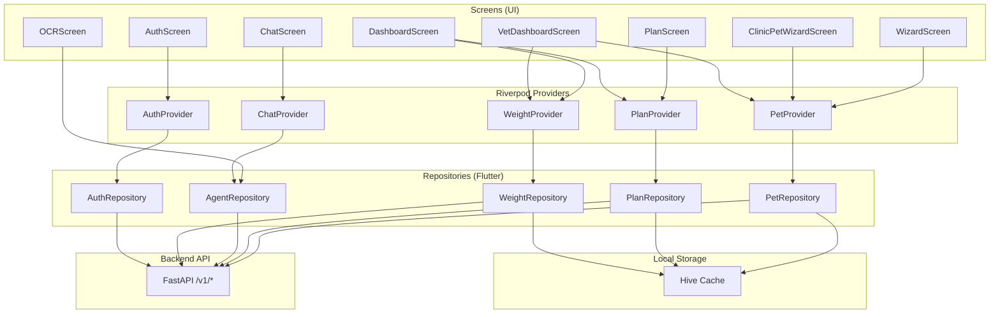

# Component Dependency Diagram — NutriVet.IA

**Versión**: 1.0
**Fecha**: 2026-03-10

**Regla**: Las flechas apuntan hacia adentro — domain no depende de nada externo.

---

## Diagrama de Dependencias (Backend)

```mermaid
flowchart TD
    subgraph DOMAIN["Domain Layer (Python puro)"]
        NRC[NRCCalculator]
        FSC[FoodSafetyChecker]
        MRE[MedicalRestrictionEngine]
        PP[PetProfile]
        NP[NutritionPlan]
        UA[UserAccount]
    end

    subgraph APPLICATION["Application Layer"]
        PGU[PlanGenerationUseCase]
        HRU[HitlReviewUseCase]
        PPU[PetProfileUseCase]
        WTU[WeightTrackingUseCase]
        EPU[ExportPlanUseCase]
        PCU[PetClaimUseCase]
        AU[AuthUseCase]
    end

    subgraph INFRASTRUCTURE["Infrastructure Layer"]
        ORC[OpenRouterClient]
        LLMRt[LLMRouter]
        LGO[LangGraphOrchestrator]
        PGRP[PostgreSQL Repositories]
        PDF[PDFGenerator]
        R2[R2StorageClient]
        FCM[FCMNotificationService]
        EMAIL[EmailNotificationService]
    end

    subgraph PRESENTATION["Presentation Layer (FastAPI)"]
        PR[PlanRouter]
        PetR[PetRouter]
        AR[AuthRouter]
        ER[ExportRouter]
        AgR[AgentRouter]
        VDR[VetDashboardRouter]
    end

    subgraph EXTERNAL["External Services"]
        OR[OpenRouter API]
        DB[(PostgreSQL 16 — Docker Hetzner)]
        R2EXT[Cloudflare R2]
        REDIS[(Redis 7 — Docker Hetzner)]
        FCMEXT[Firebase FCM]
        EMAILEXT[Resend / SMTP]
    end

    %% Application → Domain
    PGU --> NRC
    PGU --> FSC
    PGU --> MRE
    PGU --> PP
    PGU --> NP
    HRU --> NP
    PPU --> PP
    WTU --> PP
    EPU --> NP
    PCU --> PP
    AU --> UA

    %% Infrastructure → Application (puertos)
    PGRP --> PP
    PGRP --> NP
    PGRP --> UA
    LLMRt --> UA
    LGO --> NRC
    LGO --> FSC
    LGO --> MRE

    %% Infrastructure → External
    ORC --> OR
    PGRP --> DB
    LGO --> DB
    LGO --> REDIS
    PDF --> R2
    R2 --> R2EXT
    FCM --> FCMEXT
    EMAIL --> EMAILEXT

    %% Presentation → Application
    PR --> PGU
    PR --> HRU
    PetR --> PPU
    PetR --> PCU
    PetR --> WTU
    AR --> AU
    ER --> EPU
    AgR --> LGO
    VDR --> PPU
    VDR --> WTU
```

---

## Diagrama de Dependencias (Flutter Mobile)

---

## Regla de Dependencias — Verificación

| Capa | Puede depender de | No puede depender de |
|------|-------------------|----------------------|
| Domain | Nada (Python stdlib solo) | Application, Infrastructure, Presentation |
| Application | Domain | Infrastructure, Presentation |
| Infrastructure | Domain, Application | Presentation |
| Presentation | Application | Infrastructure directamente |
| Flutter Screens | Providers | Repositories directamente |
| Flutter Providers | Repositories | — |
| Flutter Repositories | API, Hive | Providers, Screens |
