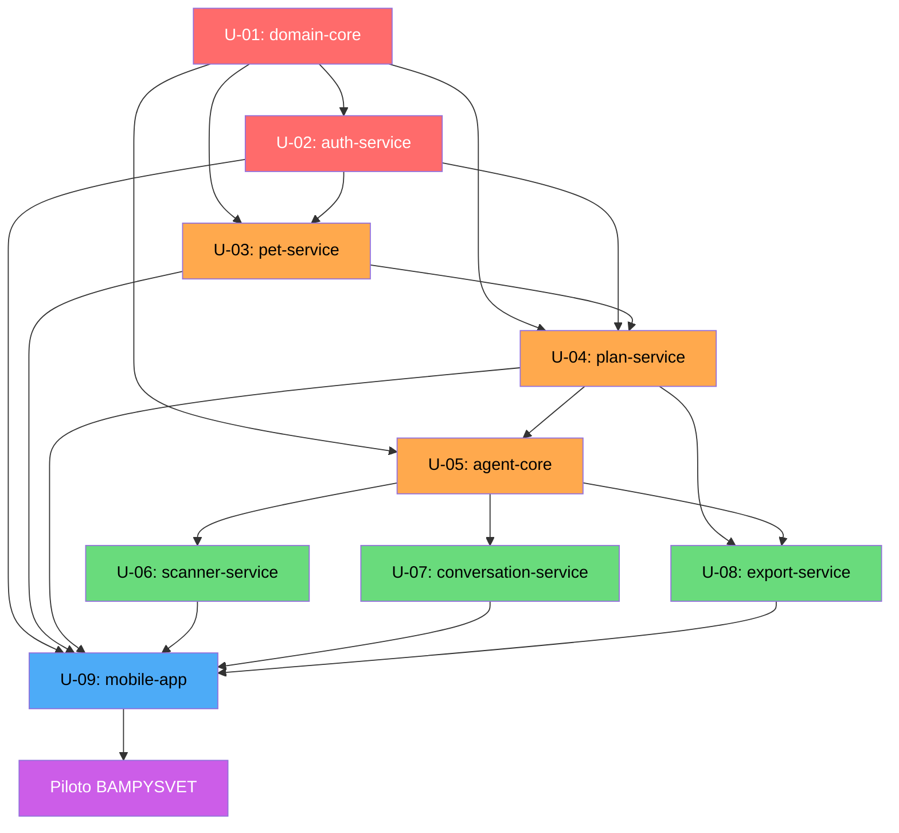

# Unit of Work — Dependency Matrix

**Fecha**: 2026-03-16

---

## Matriz de Dependencias

| Unidad | Depende de | Bloquea |
|--------|-----------|---------|
| U-01 domain-core | — (base) | U-02, U-03, U-04, U-05 |
| U-02 auth-service | U-01 | U-03, U-04, U-09 |
| U-03 pet-service | U-01, U-02 | U-04, U-09 |
| U-04 plan-service | U-01, U-02, U-03 | U-05, U-08, U-09 |
| U-05 agent-core | U-01, U-04 | U-06, U-07, U-08 |
| U-06 scanner-service | U-05 | U-09 |
| U-07 conversation-service | U-05 | U-09 |
| U-08 export-service | U-04, U-05 | U-09 |
| U-09 mobile-app | U-01…U-08 | Piloto BAMPYSVET |

---

## Diagrama Mermaid



---

## Orden de Implementación Recomendado

**Fase 1 — Núcleo** (semanas 1-2):
1. U-01: domain-core (3-4 días) — sin dependencias, base del sistema
2. U-02: auth-service (3-4 días) — requiere U-01

**Fase 2 — Datos** (semanas 3-4):
3. U-03: pet-service (5-6 días) — requiere U-01, U-02

**Fase 3 — Core de Negocio** (semanas 5-7):
4. U-04: plan-service (8-10 días) — requiere U-01, U-02, U-03

**Fase 4 — Inteligencia Artificial** (semanas 7-10):
5. U-05: agent-core (7-9 días) — requiere U-01, U-04
6. U-06, U-07, U-08 (en paralelo, semanas 9-11) — requieren U-05
   - U-06: scanner-service (5-6 días)
   - U-07: conversation-service (5-6 días)
   - U-08: export-service (4-5 días)

**Fase 5 — Mobile** (semanas 11-14):
7. U-09: mobile-app (14-16 días) — requiere U-01…U-08

---

## Paralelización Posible

```
Week  1-2:  [U-01] ────────────────────────────────
Week  2-4:           [U-02] ────────────────────────
Week  3-5:                    [U-03] ───────────────
Week  5-8:                              [U-04] ──────
Week  7-10:                                     [U-05]
Week  9-11:                                            [U-06][U-07][U-08] ← PARALELO
Week 11-14:                                                               [U-09]
```
