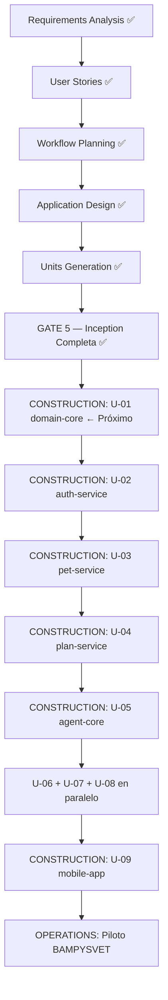

# Plan de Ejecución — Inception → Construction

**Fase AI-DLC**: Post-Inception — Transición a Construction
**Estado**: ✅ Completado — Inception cerrada, Construction iniciada
**Fecha**: 2026-03-11

---

## Plan de Fases

---

## Etapas por Fase

### INCEPTION (✅ Completada 2026-03-11)

1. ✅ Workspace Detection — clasificación BROWNFIELD
2. ✅ Reverse Engineering — 50+ docs cargados
3. ✅ Requirements Analysis — 13 áreas, 0 gaps críticos
4. ✅ User Stories — 21 stories en 9 épicas
5. ✅ Workflow Planning — diagrama de dependencias
6. ✅ Application Design — componentes, métodos, servicios
7. ✅ Units Generation — 9 unidades documentadas
8. ✅ REQ-010 / ADR-020 — Plan Visual Interactivo
9. ✅ REQ-011 / ADR-021 — Agente Conversacional Fluido
10. ✅ Migración AWS → Hetzner (ADR-022)
11. ✅ Reorganización AI-DLC (estructura estándar)

### CONSTRUCTION (⬜ En progreso)

Por cada unidad (en orden de dependencias):
- C1: Functional Design
- C2: NFR Requirements
- C3: Infrastructure Design
- C4: Code Generation Plan
- C5: Code Generation (TDD: RED → GREEN → REFACTOR)
- C6: Build and Test

**Orden**: U-01 → U-02 → U-03 → U-04 → U-05 → [U-06 + U-07 + U-08] → U-09

### OPERATIONS (⬜ No iniciado)

- Deploy a staging (Hetzner + Coolify)
- Quality Gates G1-G8
- ≥ 18/20 planes aprobados por Lady Carolina
- 10 casos red-teaming
- Piloto BAMPYSVET (Dr. Andrés)
- Deploy a producción

---

## Timeline Estimado

| Fase | Inicio | Duración | Hito |
|------|--------|----------|------|
| Inception | 2026-03-10 | 2 días | Gate 5 ✅ |
| Construction U-01 | 2026-03-16 | 3-4 días | domain-core completo |
| Construction U-02 | 2026-03-20 | 3-4 días | auth funcional |
| Construction U-03 | 2026-03-24 | 5-6 días | pet profile funcional |
| Construction U-04 | 2026-03-30 | 8-10 días | planes generándose |
| Construction U-05 | 2026-04-09 | 7-9 días | agente orquestando |
| Construction U-06/07/08 | 2026-04-18 | 5-6 días (paralelo) | scanner + chat + export |
| Construction U-09 | 2026-04-24 | 14-16 días | app móvil completa |
| Operations — Piloto | 2026-05-10 | 2-4 semanas | BAMPYSVET en vivo |
