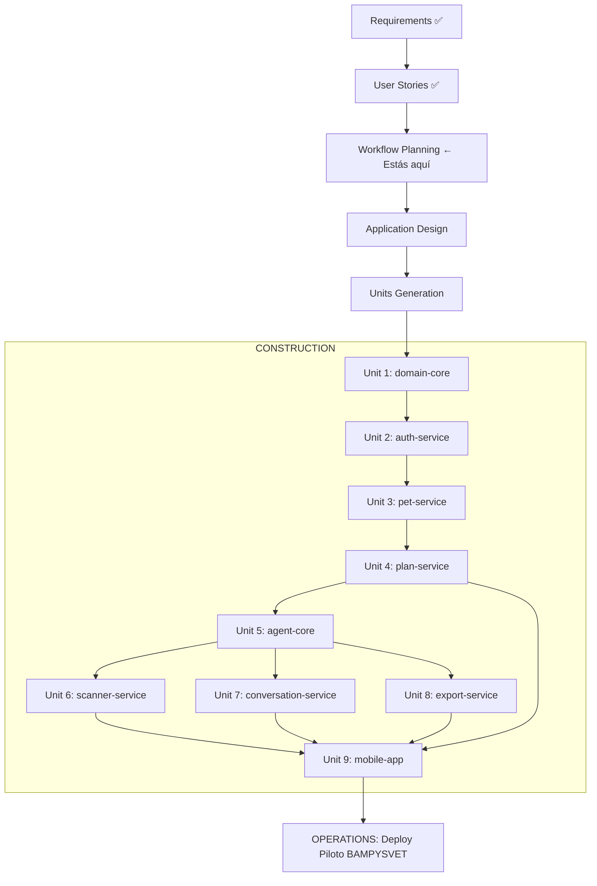

# Workflow Plan — NutriVet.IA

**Versión**: 1.0
**Fecha**: 2026-03-10
**Estado**: Aprobado — Gate 3 pendiente

---

## Diagrama de Flujo Completo



---

## Justificación de Etapas

### Etapas que se ejecutan

| Etapa | Justificación |
|-------|---------------|
| Requirements Analysis | ✅ Completado — 24 preguntas respondidas, gaps reales identificados |
| User Stories | ✅ Completado — 21 stories INVEST-compliant en 10 epics |
| Workflow Planning | Esta etapa — define el orden de construcción |
| Application Design | Sistema multi-capa con 9 unidades interdependientes — diseño obligatorio |
| Units Generation | 9 unidades con dependencias claras — necesario antes de construir |
| Construction (todas las unidades) | Aplicación nueva completa — no hay código existente |
| Operations | Deploy al piloto BAMPYSVET como objetivo final |

### Etapas que se omiten

Ninguna — NutriVet.IA es un sistema nuevo completo. Todas las etapas del AI-DLC aplican.

---

## Orden de Implementación de Unidades

El orden respeta las dependencias del grafo de dependencias:

```
Fase A — Fundamentos (sin dependencias externas)
  Unit 1: domain-core
    → NRC calculator, safety rules, toxicity lists, medical restrictions
    → Entidades puras Python — cero dependencias externas
    → BLOQUEANTE para todo lo demás

Fase B — Infraestructura de usuarios
  Unit 2: auth-service
    → JWT, RBAC, subscription tiers (owner/vet × Free/Básico/Premium/Vet)
    → Depende de: domain-core

Fase C — Datos de mascotas
  Unit 3: pet-service
    → PetProfile CRUD, wizard 13 campos, ClinicPet (owner_name + owner_phone)
    → Depende de: domain-core, auth-service

Fase D — Core del negocio
  Unit 4: plan-service
    → Plan generation lifecycle, HITL, estados, sustitutos pre-aprobados
    → Depende de: domain-core, auth-service, pet-service

Fase E — Inteligencia artificial (paralelo)
  Unit 5: agent-core
    → LangGraph orchestrator + 4 subgrafos
    → LLM routing determinístico (ADR-013)
    → Depende de: domain-core, plan-service

  Unit 6: scanner-service      ← paralelo con 7 y 8
    → OCR pipeline con Qwen2.5-VL local
    → Depende de: agent-core

  Unit 7: conversation-service ← paralelo con 6 y 8
    → Agente conversacional, límites freemium, referral node
    → Depende de: agent-core

  Unit 8: export-service       ← paralelo con 6 y 7
    → PDF generation (WeasyPrint), links TTL 72h, compartición
    → Depende de: plan-service, agent-core

Fase F — Interfaz móvil
  Unit 9: mobile-app
    → Flutter: wizard, plan view, chat, OCR, dashboard, offline (Hive)
    → Depende de: todas las unidades anteriores (consume sus APIs)
```

---

## Dependencias entre Unidades

| Unidad | Depende de |
|--------|-----------|
| domain-core | — (ninguna) |
| auth-service | domain-core |
| pet-service | domain-core, auth-service |
| plan-service | domain-core, auth-service, pet-service |
| agent-core | domain-core, plan-service |
| scanner-service | agent-core |
| conversation-service | agent-core |
| export-service | plan-service, agent-core |
| mobile-app | todas las anteriores |

---

## Criterios de Avance entre Unidades

Antes de iniciar la siguiente unidad, la unidad actual debe cumplir:

1. Tests del domain layer pasando (cobertura ≥ 80%)
2. Caso Sally reproduce RER/DER con ±0.5 kcal (aplica desde Unit 1)
3. 0 toxicos en planes generados (aplica desde Unit 4)
4. Gate de Construction aprobado por Sadid

---

## Timeline de Referencia

| Fase | Unidades | Objetivo |
|------|----------|----------|
| Fase 1 (días 1-30) | domain-core, auth-service, pet-service | Domain layer + identidad + perfil |
| Fase 2 (días 31-60) | plan-service, agent-core, conversation-service | Plan + HITL + agente |
| Fase 3 (días 61-90) | scanner-service, export-service, mobile-app | OCR + PDF + Flutter + piloto BAMPYSVET |
